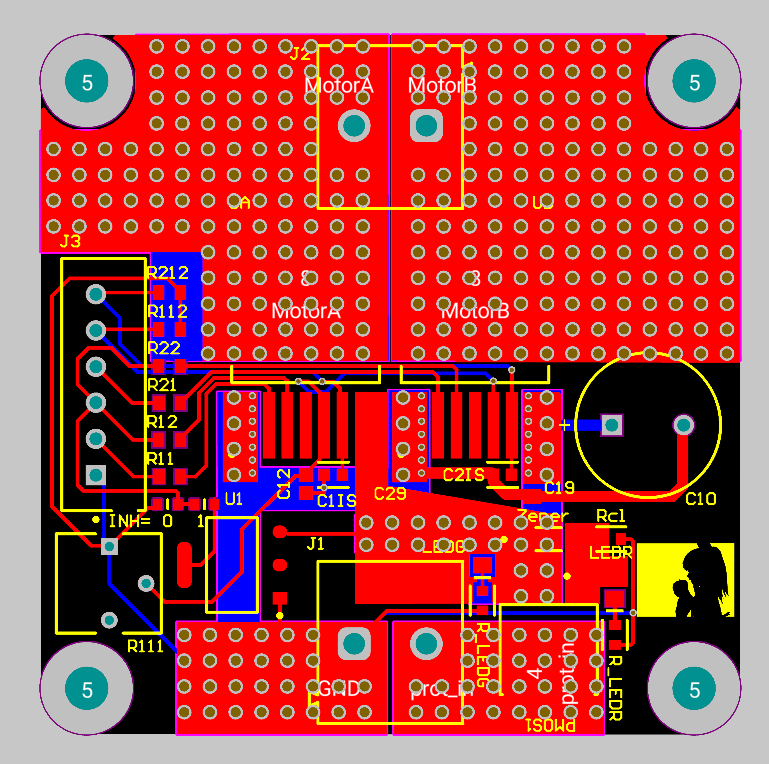
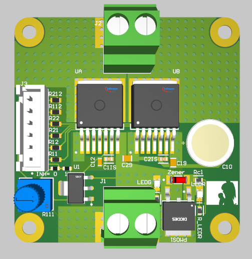
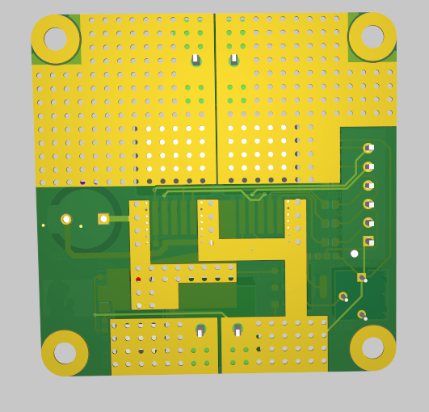
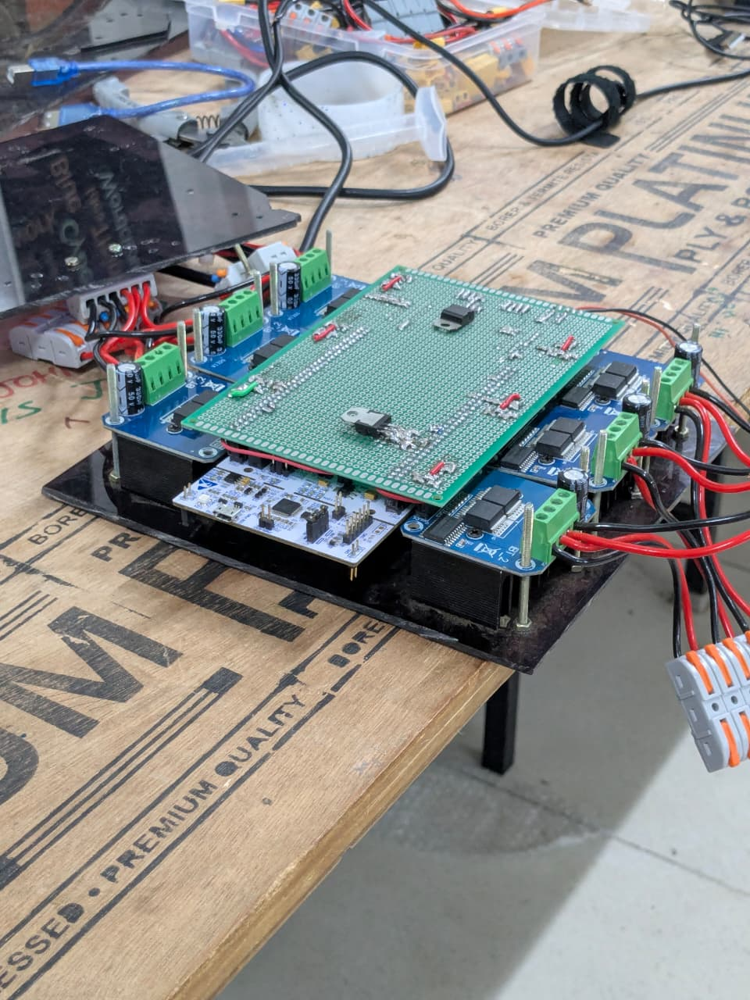

[PCB design projects](README.md)

# IFX007T Motor Driver Board

I wanted a motor driver with an open schematic so parts could be replaced when needed. The design is based on IFX007T.

## Schematic

The idea started from a BTS7960-based motor driver used on the rover for IRC26.

  

  

## Layout / Routing

  

## 3D Model / Printed PCB

  

  

## Additional Info

The BTS7960 is no longer manufactured, so I moved to the IFX007T.

  

  

The ICs are rated for 55A, so the PCB was designed to support 55A.

The potentiometer controls the slew rate of the half-bridge MOSFETs. This was a prototype motor driver that future motor drivers could be based on.

Like the PDB, the copper behind the motor driver can be tinned with solder to allow more current to pass through. The thicker the solder, the more current this can handle.
