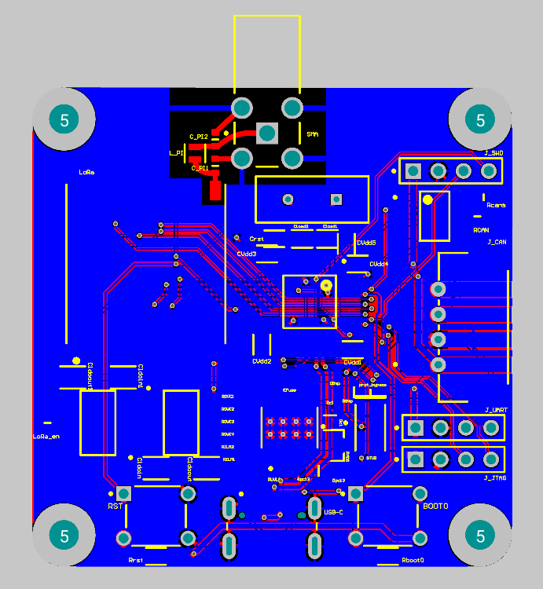
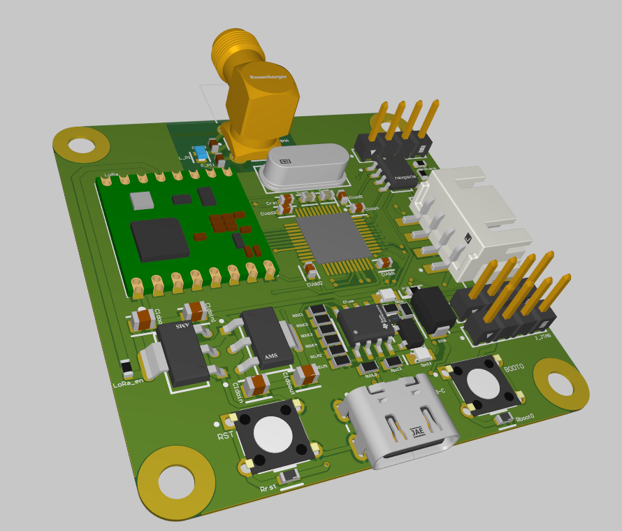
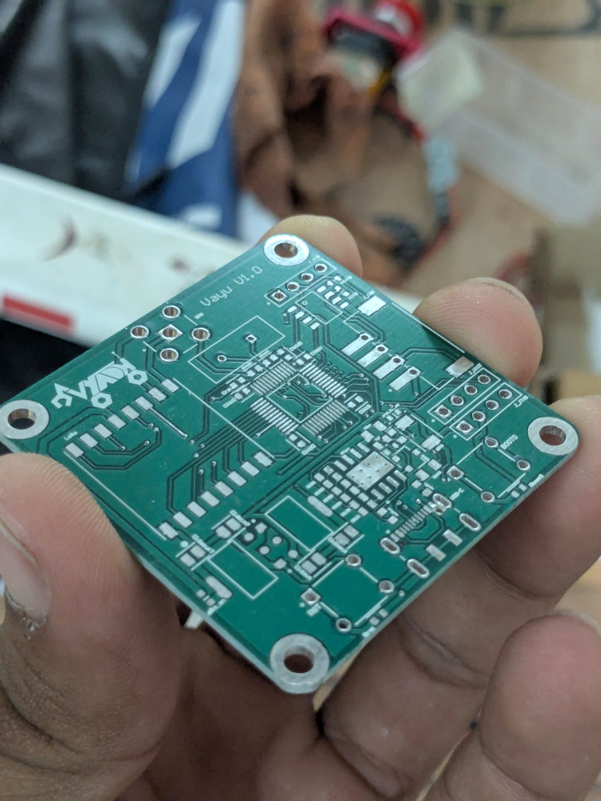
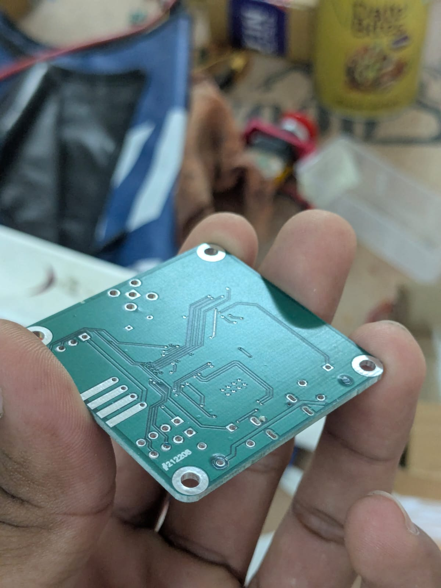

[PCB design projects](README.md)

# LoRa + STM32F103 Development Board

This board combines an STM32F103 with an RFM98W 433 MHz LoRa module.

Revision 1 was printed and assembled. During bring-up, the board did not respond correctly. The protection circuitry also did not behave as expected, and there appears to be a short or power issue that still needs to be isolated. Revision 2 is planned to fix these issues.

## Schematic

  

## Layout / Routing

  

  

## 3D Model / Printed PCB

  

  

  

  

  

  

## Additional Info

It includes protection circuitry for over voltage, reverse voltage, and over current.

The purpose was to verify that this module could be built and used as a base for more modules.

## Revision 2 Fix List

1. Recheck the protection circuitry.
2. Find the short or power fault.
3. Verify the power rails before connecting the STM32 and LoRa module.
4. Confirm that the board responds after assembly.
