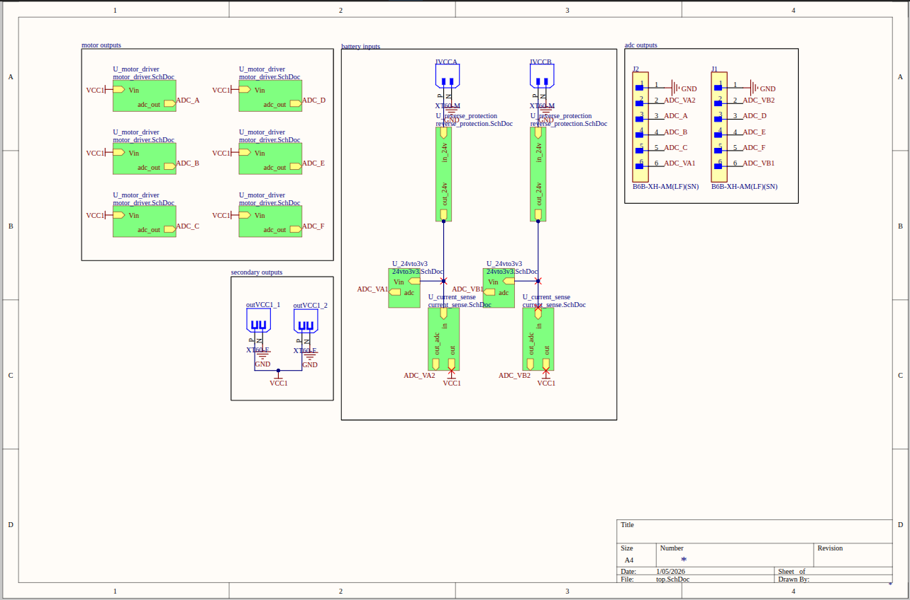
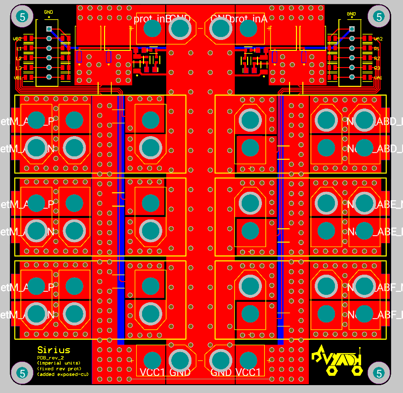
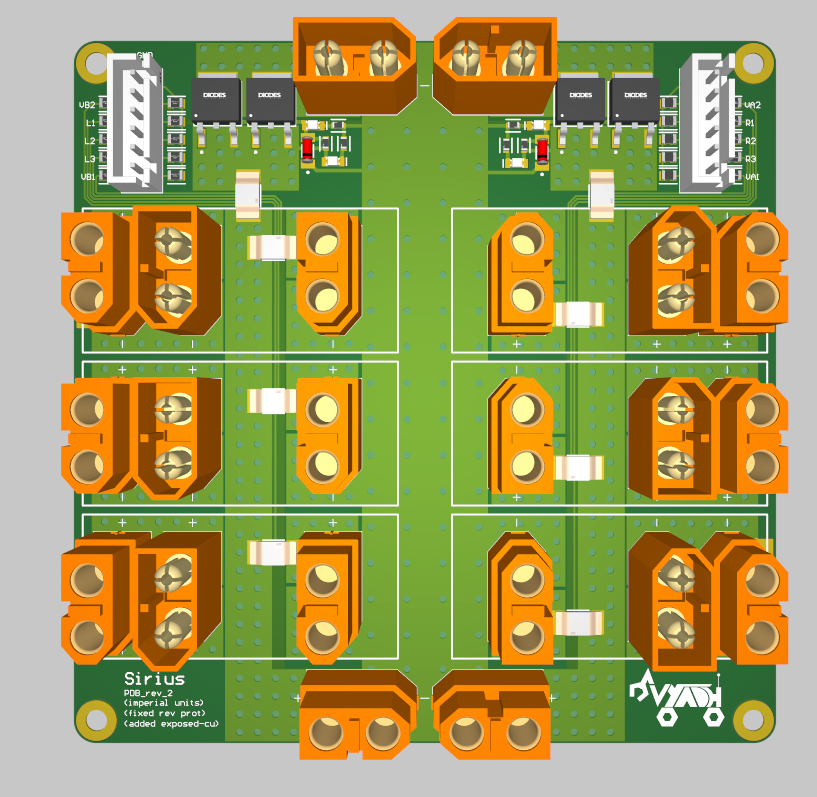
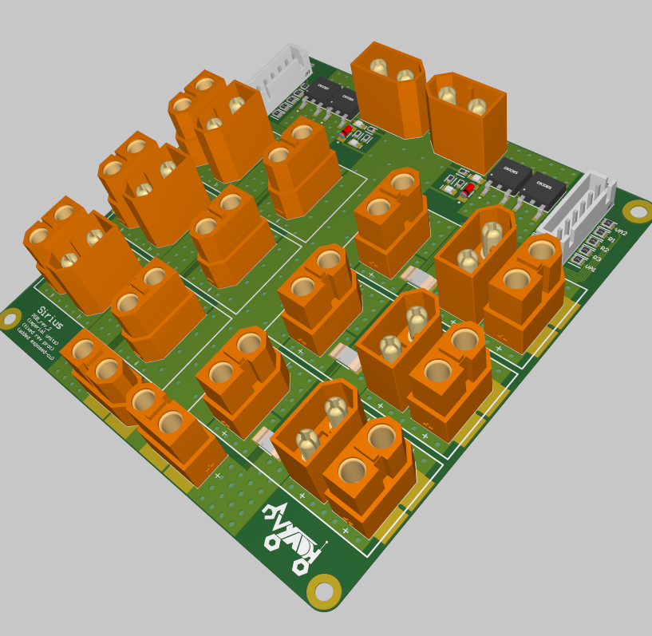
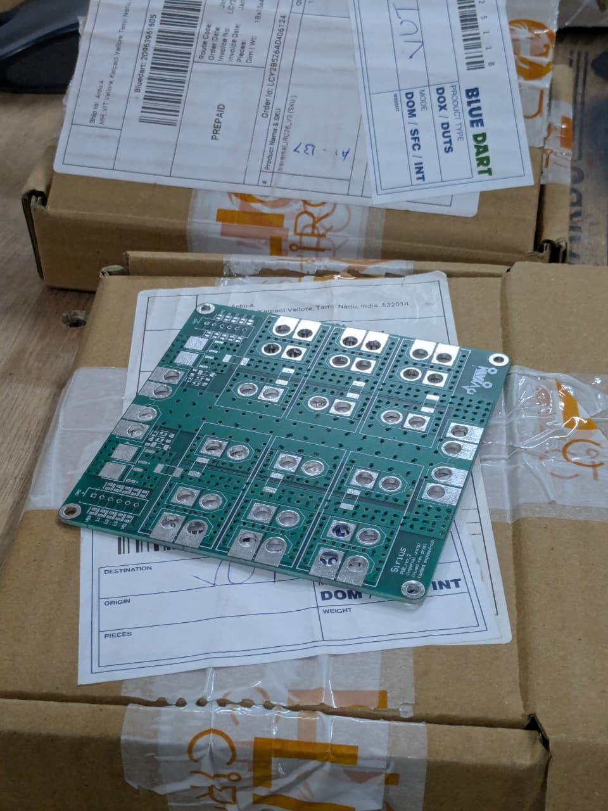
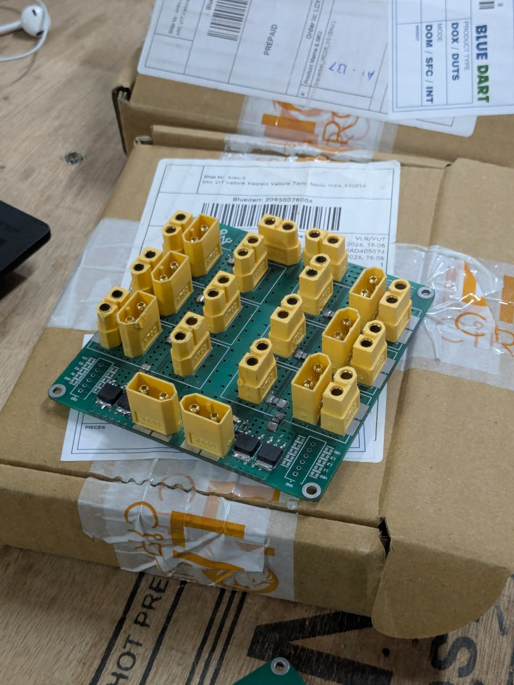
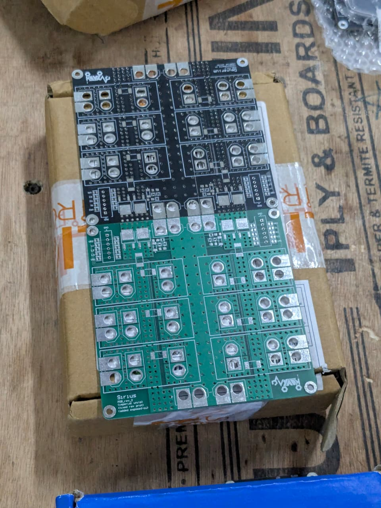
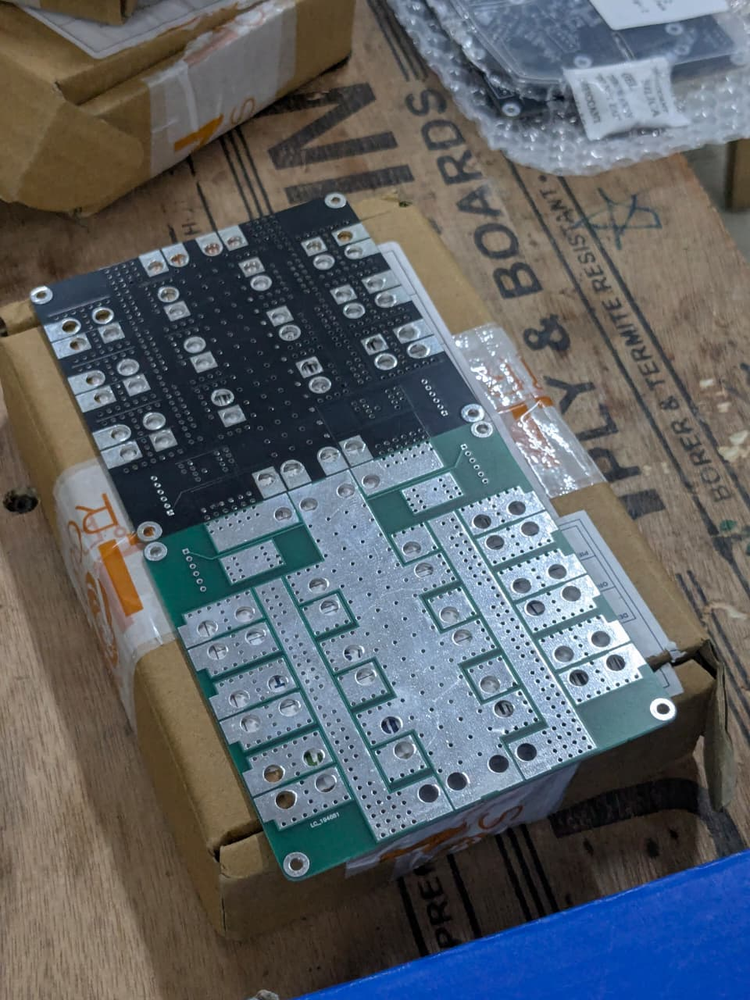

[PCB design projects](README.md)

# Power Distribution Board

This PDB was designed to handle up to 200A at 24V, with reverse voltage and current sensing. The first iteration was manufactured by JLC PCB and the second iteration by Lion Circuits.

## Schematic

  

## Layout / Routing

  

  

## 3D Model / Printed PCB

  

Printed by Lion Circuits and assembled by me.

  

  

  

  

## Additional Info

The high current capacity comes from exposed copper pads. These pads can be tinned with solder so very high currents can pass through them.

The design went through multiple iterations.

  

  

