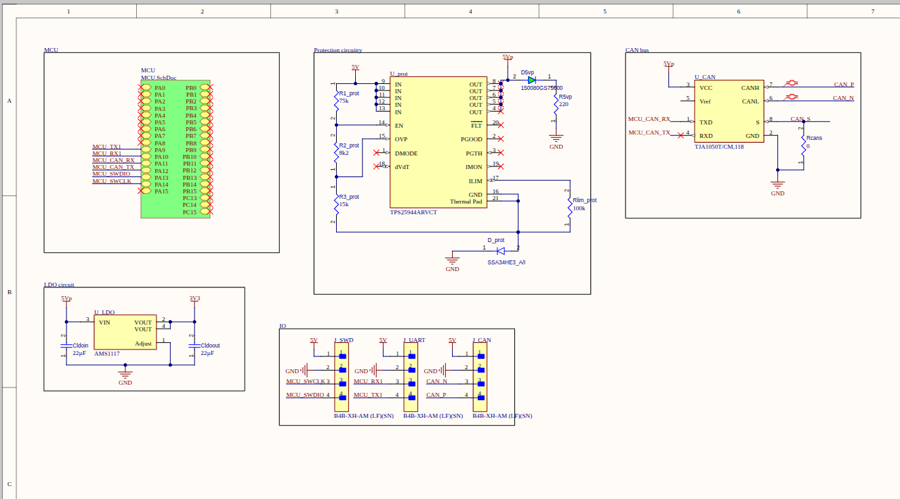
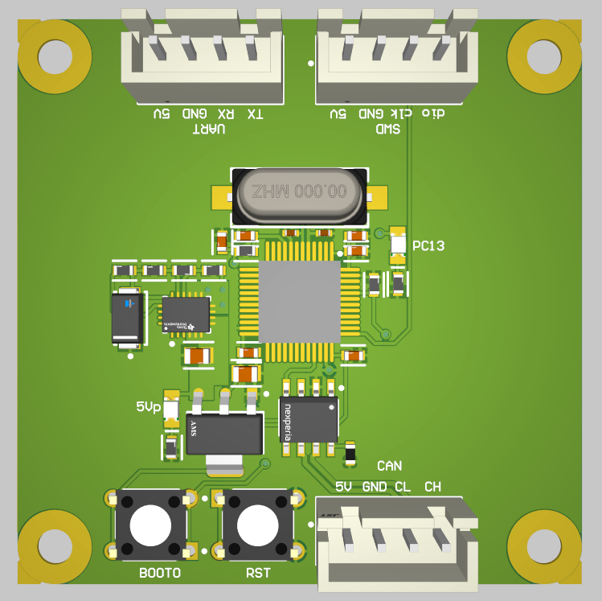
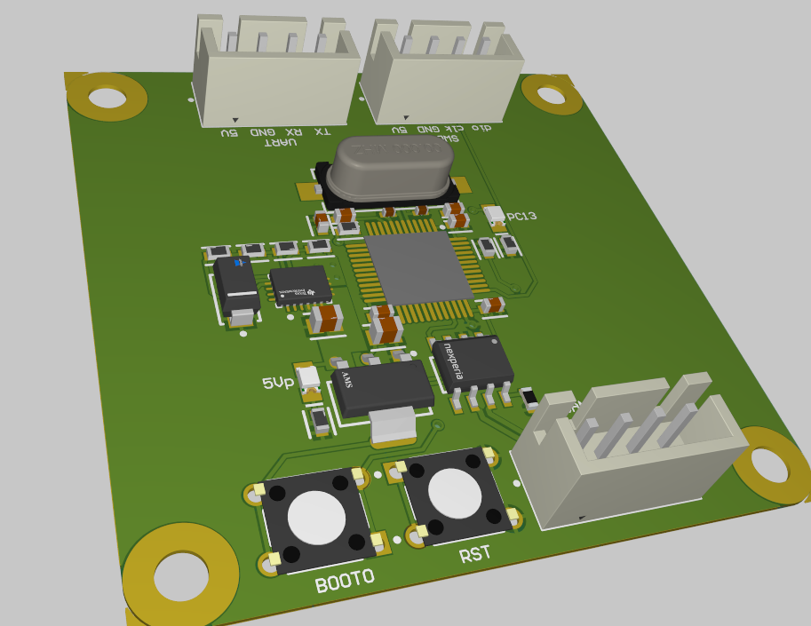

[PCB design projects](README.md)

# STM32F103 Development Board

I made this board as my first board with embedded ICs instead of using dev boards. It was made as a sample for future embedded-IC boards. It was manufactured by JLC PCB.

## Schematic

  

## Layout / Routing

  

  

## 3D Model / Printed PCB

  

  

## Additional Info

This project was a base for learning embedded-IC PCB design.
